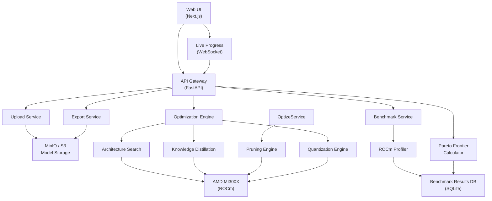

# ForgeAI — Hackathon Build Plan

## Table of Contents
1. [System Architecture](#1-system-architecture)
2. [Tech Stack](#2-tech-stack)
3. [API Design](#3-api-design)
4. [Module Breakdown](#4-module-breakdown)
5. [Implementation Checklist](#5-implementation-checklist)
6. [DevOps & Deployment](#6-devops--deployment)
7. [Testing Strategy](#7-testing-strategy)
8. [Hackathon Timeline](#8-hackathon-timeline)

---

## 1. System Architecture

### High-Level Design



### Architecture Decisions

#### ADR-001: Monolith with Clean Module Boundaries

**Decision:** Build as a monolithic FastAPI application with clear internal module boundaries, not microservices.

**Rationale:**
- Hackathon timeline (3-5 days) makes microservices overhead unjustifiable
- Single deployable artifact simplifies ROCm/GPU access
- Can extract services later if scaling requires it
- Internal module boundaries (ports/adapters pattern) keep the door open for future extraction

**Trade-offs:**
- Simpler deployment and debugging
- No network latency between internal components
- Harder to scale individual components independently (acceptable for hackathon)

#### ADR-002: PyTorch + ROCm for GPU Operations

**Decision:** Use PyTorch with ROCm backend for all GPU operations.

**Rationale:**
- Direct AMD MI300X support via ROCm
- Native `torch.cuda` API compatibility (just swap device to `cuda` with ROCm)
- PyTorch ecosystem has all required tools (torchvision, timm for models)

**Trade-offs:**
- ROCm has smaller ecosystem than CUDA
- Some libraries may need ROCm-specific builds
- Testing locally on NVIDIA requires CUDA builds (mitigated by Docker)

#### ADR-003: SQLite for Benchmark Results

**Decision:** Use SQLite for storing benchmark results and optimization history.

**Rationale:**
- Zero setup, single file database
- Sufficient for hackathon scale (thousands of benchmark rows)
- Easy to export and share results
- No database server to manage

**Trade-offs:**
- Not suitable for concurrent high-write production
- Can migrate to PostgreSQL later

#### ADR-004: WebSocket for Live Optimization Progress

**Decision:** Use WebSocket for streaming optimization progress to the UI.

**Rationale:**
- Optimization runs take minutes to hours
- Users need real-time feedback on candidate evaluations
- Live leaderboard updates are a key demo feature
- FastAPI has native WebSocket support

**Trade-offs:**
- More complex than polling
- Requires connection management
- Acceptable complexity for demo value

---

## 2. Tech Stack

### Backend
| Component | Technology | Rationale |
|-----------|-----------|-----------|
| API Framework | FastAPI 0.110+ | Async, WebSocket native, Pydantic v2, auto OpenAPI |
| ML Framework | PyTorch 2.2+ | ROCm support, torch.compile, model zoo |
| Model Zoo | timm, torchvision | Pre-trained vision models (DINOv2, ViT) |
| Quantization | torch.ao.quantization | Native PyTorch quantization |
| Export | ONNX, TorchScript | Standard deployment formats |
| Benchmarking | Custom ROCm profiler | Latency, throughput, VRAM measurement |
| Database | SQLite + aiosqlite | Async SQLite for benchmark results |
| Task Queue | asyncio + Celery (optional) | Long-running optimization jobs |
| WebSocket | FastAPI WebSocket | Live progress streaming |

### Frontend
| Component | Technology | Rationale |
|-----------|-----------|-----------|
| Framework | Next.js 14 (App Router) | React + SSR, fast iteration |
| UI Library | Tailwind CSS + shadcn/ui | Rapid, polished UI |
| Charts | Recharts or Plotly.js | Pareto frontier visualization |
| WebSocket | native WebSocket API | Real-time optimization feed |
| Deployment | Static export or Vercel | Free hosting for demo |

### Infrastructure
| Component | Technology | Rationale |
|-----------|-----------|-----------|
| Container | Docker + Dockerfile | Reproducible ROCm environment |
| GPU Access | ROCm 6.0+ | AMD MI300X support |
| CI/CD | GitHub Actions | Auto-build, test, deploy |
| Storage | MinIO (S3-compatible) | Local model artifact storage |
| Monitoring | Prometheus + Grafana (optional) | GPU metrics during benchmarking |

---

## 3. API Design

### Contract: REST API

**Style:** REST with WebSocket for streaming  
**Consumers:** Next.js frontend, CLI tool (future)  
**Primary job:** Orchestrate model optimization and deliver benchmarked results

### Resources

| Resource | Purpose |
|----------|---------|
| `/api/v1/models` | Upload and manage teacher models |
| `/api/v1/optimizations` | Run and track optimization jobs |
| `/api/v1/candidates` | Student architecture candidates |
| `/api/v1/benchmarks` | Benchmark results |
| `/api/v1/exports` | Download optimized models |
| `/api/v1/hardware` | Available hardware targets |

### Operations

#### Models

| Operation | Purpose | Input | Output | Notes |
|-----------|---------|-------|--------|-------|
| `POST /api/v1/models` | Upload teacher model | multipart file + metadata | Model ID | Accepts .pt, .pth, .onnx |
| `GET /api/v1/models` | List uploaded models | query params | Model list | Paginated |
| `GET /api/v1/models/{id}` | Get model details | path param | Model metadata | Architecture, size, params |
| `DELETE /api/v1/models/{id}` | Delete model | path param | 204 No Content | |

#### Optimizations

| Operation | Purpose | Input | Output | Notes |
|-----------|---------|-------|--------|-------|
| `POST /api/v1/optimizations` | Start optimization job | model_id, hardware, constraints | Job ID | Creates async job |
| `GET /api/v1/optimizations` | List optimization jobs | query params | Job list | Filter by status |
| `GET /api/v1/optimizations/{id}` | Get job status | path param | Job status + progress | Includes phase info |
| `DELETE /api/v1/optimizations/{id}` | Cancel optimization | path param | 204 No Content | Stops GPU processing |
| `WS /api/v1/optimizations/{id}/stream` | Live progress stream | — | WebSocket frames | Candidate evaluations, metrics |

#### Candidates

| Operation | Purpose | Input | Output | Notes |
|-----------|---------|-------|--------|-------|
| `GET /api/v1/optimizations/{id}/candidates` | List candidates for job | path param | Candidate list | With accuracy/latency metrics |
| `GET /api/v1/candidates/{id}` | Get candidate details | path param | Full metrics | All benchmark data |

#### Benchmarks

| Operation | Purpose | Input | Output | Notes |
|-----------|---------|-------|--------|-------|
| `GET /api/v1/benchmarks` | Query benchmark results | filters | Benchmark list | By hardware, model, date |
| `GET /api/v1/benchmarks/pareto` | Get Pareto frontier | job_id, objectives | Pareto set | Multi-objective optimization |

#### Exports

| Operation | Purpose | Input | Output | Notes |
|-----------|---------|-------|--------|-------|
| `POST /api/v1/exports` | Export optimized model | candidate_id, format | Export job ID | ONNX, TorchScript, JIT |
| `GET /api/v1/exports/{id}` | Download exported model | path param | Binary file | .onnx, .pt, .bin |
| `GET /api/v1/exports/{id}/report` | Download benchmark report | path param | PDF/HTML report | Performance comparison |

#### Hardware

| Operation | Purpose | Input | Output | Notes |
|-----------|---------|-------|--------|-------|
| `GET /api/v1/hardware` | List available targets | — | Hardware list | With specs |
| `GET /api/v1/hardware/{id}` | Get hardware details | path param | GPU/CPU specs | VRAM, bandwidth, cores |

### Request/Response Schemas

#### POST /api/v1/optimizations

```json
// Request
{
  "model_id": "uuid",
  "hardware_target": "mi300x",
  "constraints": {
    "max_latency_ms": 20,
    "max_memory_gb": 2.0,
    "min_accuracy": 0.95
  },
  "objectives": ["accuracy", "latency", "throughput", "vram"],
  "search_space": {
    "student_architectures": ["auto"],
    "pruning_ratios": [0.1, 0.3, 0.5, 0.7],
    "quantization_modes": ["int8", "fp8", "int4"]
  }
}

// Response
{
  "id": "uuid",
  "status": "queued",
  "created_at": "2026-07-09T10:00:00Z",
  "hardware_target": "mi300x",
  "total_phases": 6,
  "current_phase": null
}
```

#### WebSocket Stream Messages

```json
// Candidate evaluation started
{
  "type": "candidate_started",
  "candidate_id": "uuid",
  "architecture": "vit_small_patch16_224",
  "params_m": 22.1,
  "phase": "distillation"
}

// Candidate evaluated
{
  "type": "candidate_evaluated",
  "candidate_id": "uuid",
  "metrics": {
    "accuracy_top1": 0.942,
    "latency_ms": 14.3,
    "throughput_img_s": 287,
    "vram_gb": 1.8,
    "flops_g": 4.6
  },
  "pareto_rank": 2,
  "is_pareto_optimal": true
}

// Optimization complete
{
  "type": "optimization_complete",
  "winner_id": "uuid",
  "pareto_frontier": [...],
  "total_candidates": 24,
  "total_time_s": 1842
}
```

### Error Model

```json
{
  "error": {
    "code": "CONSTRAINTS_INFEASIBLE",
    "message": "No architecture can meet all constraints simultaneously",
    "details": {
      "min_latency_achieved_ms": 18.2,
      "min_vram_achieved_gb": 2.1
    }
  }
}
```

Error codes: `MODEL_NOT_FOUND`, `HARDWARE_UNAVAILABLE`, `CONSTRAINTS_INFEASIBLE`, `GPU_OUT_OF_MEMORY`, `OPTIMIZATION_CANCELLED`

---

## 4. Module Breakdown

### Module Structure

```
forgeai/
├── backend/
│   ├── main.py                    # FastAPI app, lifespan, middleware
│   ├── config.py                  # Settings, env vars
│   ├── api/
│   │   ├── models.py              # /api/v1/models endpoints
│   │   ├── optimizations.py       # /api/v1/optimizations endpoints
│   │   ├── candidates.py          # /api/v1/candidates endpoints
│   │   ├── benchmarks.py          # /api/v1/benchmarks endpoints
│   │   ├── exports.py             # /api/v1/exports endpoints
│   │   ├── hardware.py            # /api/v1/hardware endpoints
│   │   └── websocket.py           # WebSocket handler
│   ├── core/
│   │   ├── architecture_search.py # Student architecture generation
│   │   ├── distillation.py        # Knowledge distillation engine
│   │   ├── pruning.py             # Structured/unstructured pruning
│   │   ├── quantization.py        # INT8/FP8/INT4 quantization
│   │   ├── benchmark.py           # ROCm benchmarking profiler
│   │   ├── pareto.py              # Multi-objective Pareto optimization
│   │   ├── optimizer.py           # Main optimization orchestrator
│   │   └── export.py              # ONNX/TorchScript export
│   ├── models/
│   │   ├── schemas.py             # Pydantic request/response models
│   │   └── database.py            # SQLite async models
│   ├── services/
│   │   ├── model_service.py       # Model upload/storage logic
│   │   ├── optimization_service.py # Optimization job management
│   │   └── benchmark_service.py   # Benchmark result storage
│   └── utils/
│       ├── rocm.py                # ROCm detection and config
│       ├── gpu_profiler.py        # GPU metrics collection
│       └── file_utils.py          # File handling utilities
├── frontend/
│   ├── src/
│   │   ├── app/
│   │   │   ├── page.tsx           # Landing page
│   │   │   ├── upload/
│   │   │   │   └── page.tsx       # Model upload flow
│   │   │   ├── optimize/
│   │   │   │   └── page.tsx       # Optimization config + live view
│   │   │   ├── results/
│   │   │   │   ├── page.tsx       # Results leaderboard
│   │   │   │   └── [id]/page.tsx  # Pareto frontier view
│   │   │   └── export/
│   │   │       └── page.tsx       # Download deployment package
│   │   ├── components/
│   │   │   ├── ui/                # shadcn components
│   │   │   ├── upload-zone.tsx
│   │   │   ├── hardware-selector.tsx
│   │   │   ├── constraint-editor.tsx
│   │   │   ├── live-progress.tsx
│   │   │   ├── candidate-card.tsx
│   │   │   ├── leaderboard-table.tsx
│   │   │   ├── pareto-chart.tsx
│   │   │   └── benchmark-comparison.tsx
│   │   └── lib/
│   │       ├── api.ts             # API client
│   │       └── websocket.ts       # WebSocket client
│   └── package.json
├── docker/
│   ├── Dockerfile.rocm            # ROCm + PyTorch image
│   └── docker-compose.yml         # Local dev environment
├── tests/
│   ├── test_architecture_search.py
│   ├── test_distillation.py
│   ├── test_benchmark.py
│   ├── test_pareto.py
│   └── test_api.py
└── docs/
    ├── architecture.md
    └── demo-script.md
```

### Core Modules Detail

#### 1. Architecture Search (`core/architecture_search.py`)
- Generates candidate student architectures from a search space
- Uses NAS-inspired approach: vary depth, width, attention heads, patch size
- For vision: generate ViT variants (tiny, small, base) with different configs
- For language: generate small transformer variants
- Returns a list of architecture configs to evaluate

#### 2. Knowledge Distillation (`core/distillation.py`)
- Takes teacher model + student architecture + training data
- Applies temperature-scaled KD loss + task loss
- Uses feature-level distillation where possible
- Returns trained student weights

#### 3. Pruning (`core/pruning.py`)
- Structured pruning: remove entire channels/heads
- Unstructured pruning: remove individual weights
- Supports magnitude-based and movement-based pruning
- Returns pruned model + sparsity metrics

#### 4. Quantization (`core/quantization.py`)
- Post-training quantization (PTQ): INT8, FP8, INT4
- Quantization-aware training (QAT) for higher accuracy
- Uses `torch.ao.quantization` for INT8
- Custom kernels for FP8/INT4 on ROCm

#### 5. Benchmark (`core/benchmark.py`)
- Measures latency (single inference, batched)
- Measures throughput (images/second, tokens/second)
- Measures VRAM usage (peak, average)
- Measures FLOPS
- Uses ROCm profiler for hardware-specific metrics
- Runs multiple iterations for statistical significance

#### 6. Pareto Frontier (`core/pareto.py`)
- Multi-objective optimization across accuracy, latency, throughput, VRAM
- Computes Pareto frontier of non-dominated solutions
- Supports weighted scalarization for single-score ranking
- Returns Pareto-optimal set + dominated set

#### 7. Optimizer Orchestrator (`core/optimizer.py`)
- Coordinates the full pipeline: search → distill → prune → quantize → benchmark
- Manages GPU resources and job state
- Streams progress via WebSocket
- Handles cancellation and error recovery

---

## 5. Implementation Checklist

### Phase 1: Foundation (Day 1)
- [ ] Initialize Python project with Poetry/pyproject.toml
- [ ] Set up FastAPI app with CORS, health check
- [ ] Create Pydantic schemas for all API models
- [ ] Set up SQLite database with async driver
- [ ] Create Dockerfile with ROCm + PyTorch base image
- [ ] Set up Next.js project with Tailwind + shadcn/ui
- [ ] Create basic API routes (stub implementations)

### Phase 2: Core Engine (Day 2)
- [ ] Implement architecture search (generate student configs)
- [ ] Implement knowledge distillation engine
- [ ] Implement pruning engine
- [ ] Implement quantization engine
- [ ] Implement ROCm benchmark profiler
- [ ] Implement Pareto frontier calculator
- [ ] Wire up optimizer orchestrator

### Phase 3: API & Integration (Day 3)
- [ ] Implement model upload endpoint with storage
- [ ] Implement optimization job management
- [ ] Implement WebSocket progress streaming
- [ ] Implement benchmark result storage
- [ ] Implement export endpoints (ONNX, TorchScript)
- [ ] Connect frontend to backend APIs
- [ ] Test end-to-end optimization flow

### Phase 4: Frontend (Day 4)
- [ ] Build model upload page with drag-and-drop
- [ ] Build hardware selector component
- [ ] Build constraint editor (latency, memory, accuracy)
- [ ] Build live optimization progress view
- [ ] Build candidate leaderboard table
- [ ] Build Pareto frontier chart
- [ ] Build export/download page

### Phase 5: Polish & Demo (Day 5)
- [ ] End-to-end testing with real models
- [ ] Create demo script and walkthrough
- [ ] Write README and documentation
- [ ] Record demo video
- [ ] Final UI polish and error handling
- [ ] Deploy and verify on target hardware

---

## 6. DevOps & Deployment

### Docker Setup

```dockerfile
# Dockerfile.rocm
FROM rocm/pytorch:rocm6.0-py3.11-base

WORKDIR /app

# System dependencies
RUN apt-get update && apt-get install -y \
    git curl wget && \
    rm -rf /var/lib/apt/lists/*

# Python dependencies
COPY backend/requirements.txt .
RUN pip install --no-cache-dir -r requirements.txt

# Copy application code
COPY backend/ ./backend/
COPY frontend/ ./frontend/

# Health check
HEALTHCHECK --interval=30s --timeout=5s \
    CMD curl -f http://localhost:8000/health || exit 1

EXPOSE 8000
CMD ["uvicorn", "backend.main:app", "--host", "0.0.0.0", "--port", "8000"]
```

### Docker Compose

```yaml
version: '3.8'

services:
  backend:
    build:
      context: .
      dockerfile: docker/Dockerfile.rocm
    ports:
      - "8000:8000"
    volumes:
      - ./data:/app/data
    deploy:
      resources:
        reservations:
          devices:
            - driver: amdgpu
              count: 1
              capabilities: [gpu]
    environment:
      - FORGEAI_DATA_DIR=/app/data
      - FORGEAI_ROCM_VISIBLE_DEVICES=0
    healthcheck:
      test: ["CMD", "curl", "-f", "http://localhost:8000/health"]
      interval: 30s
      timeout: 5s
      retries: 3

  frontend:
    build:
      context: ./frontend
      dockerfile: Dockerfile
    ports:
      - "3000:3000"
    depends_on:
      - backend
    environment:
      - NEXT_PUBLIC_API_URL=http://backend:8000

  # Optional: MinIO for model storage
  minio:
    image: minio/minio
    ports:
      - "9000:9000"
      - "9001:9001"
    volumes:
      - minio_data:/data
    command: server /data --console-address ":9001"
    environment:
      - MINIO_ROOT_USER=minioadmin
      - MINIO_ROOT_PASSWORD=minioadmin

volumes:
  minio_data:
```

### GitHub Actions CI

```yaml
name: CI

on:
  push:
    branches: [main]
  pull_request:
    branches: [main]

jobs:
  lint-test:
    runs-on: ubuntu-latest
    steps:
      - uses: actions/checkout@v4
      
      - name: Set up Python
        uses: actions/setup-python@v5
        with:
          python-version: '3.11'
      
      - name: Install dependencies
        run: |
          pip install -r backend/requirements.txt
          pip install -r backend/requirements-dev.txt
      
      - name: Lint
        run: |
          ruff check backend/
          black --check backend/
      
      - name: Type check
        run: mypy --strict backend/
      
      - name: Test
        run: pytest tests/ -v --cov=backend

  build-docker:
    runs-on: ubuntu-latest
    needs: lint-test
    steps:
      - uses: actions/checkout@v4
      
      - name: Build Docker image
        run: docker build -f docker/Dockerfile.rocm -t forgeai:latest .
      
      - name: Test Docker image
        run: docker run --rm forgeai:latest python -c "from backend.main import app; print('OK')"
```

### Deployment Options (Hackathon)

| Option | Cost | Effort | Demo Quality |
|--------|------|--------|--------------|
| Local on MI300X | $0 | Low | Best (real hardware) |
| Vercel (frontend) + local backend | $0 | Medium | Good |
| AWS/GCP with MI300X | $$$ | High | Best |
| HuggingFace Spaces | $0 | Medium | Good |

**Recommended:** Local demo on MI300X for the hackathon. Deploy frontend to Vercel for the submission link.

---

## 7. Testing Strategy

### Unit Tests

| Module | Test Coverage Target | Key Tests |
|--------|---------------------|-----------|
| `architecture_search.py` | >90% | Generate valid architectures, respect constraints |
| `distillation.py` | >85% | Loss computation, training loop, convergence |
| `pruning.py` | >90% | Sparsity calculation, structured pruning |
| `quantization.py` | >85% | INT8/FP8 accuracy, export correctness |
| `benchmark.py` | >80% | Latency measurement, VRAM tracking |
| `pareto.py` | >95% | Frontier correctness, dominance checking |
| API endpoints | >90% | Request validation, error handling |

### Integration Tests

- End-to-end optimization: upload → optimize → benchmark → export
- WebSocket streaming: verify progress updates are received
- Hardware detection: verify ROCm availability
- Export formats: ONNX and TorchScript load correctly

### Performance Tests

- Benchmark measurement accuracy vs known baselines
- Optimization pipeline throughput (candidates/minute)
- API response times under load
- WebSocket connection stability

### Test Commands

```bash
# Run all tests
pytest tests/ -v

# Run with coverage
pytest tests/ --cov=backend --cov-report=html

# Run specific module tests
pytest tests/test_pareto.py -v

# Type checking
mypy --strict backend/

# Linting
ruff check backend/
black --check backend/
```

---

## 8. Hackathon Timeline

### Day 1: Foundation
**Goal:** Working project skeleton with all APIs stubbed

- [ ] 9:00 - Project setup (Python, FastAPI, Next.js)
- [ ] 11:00 - Database schema + Pydantic models
- [ ] 13:00 - API route stubs with mock responses
- [ ] 15:00 - Docker setup with ROCm base image
- [ ] 17:00 - Frontend scaffold with routing
- [ ] 19:00 - Verify everything runs

### Day 2: Core Engine
**Goal:** Optimization pipeline works on synthetic data

- [ ] 9:00 - Architecture search (generate student configs)
- [ ] 11:00 - Knowledge distillation engine
- [ ] 13:00 - Pruning engine
- [ ] 15:00 - Quantization engine
- [ ] 17:00 - Benchmark profiler
- [ ] 19:00 - Pareto frontier calculator

### Day 3: Integration
**Goal:** Full pipeline works end-to-end via API

- [ ] 9:00 - Wire optimizer orchestrator
- [ ] 11:00 - Model upload with storage
- [ ] 13:00 - WebSocket progress streaming
- [ ] 15:00 - Connect frontend to backend
- [ ] 17:00 - Test with real model (DINOv2)
- [ ] 19:00 - Debug and fix issues

### Day 4: Frontend & Polish
**Goal:** Polished UI with live demo capability

- [ ] 9:00 - Upload page with drag-and-drop
- [ ] 11:00 - Hardware selector + constraint editor
- [ ] 13:00 - Live optimization progress view
- [ ] 15:00 - Leaderboard + Pareto chart
- [ ] 17:00 - Export/download page
- [ ] 19:00 - UI polish, error states

### Day 5: Demo & Submission
**Goal:** Demo-ready, submitted, documented

- [ ] 9:00 - Full end-to-end test run
- [ ] 11:00 - Create demo script
- [ ] 13:00 - Record demo video
- [ ] 15:00 - Write README + docs
- [ ] 17:00 - Final bug fixes
- [ ] 19:00 - Submit to hackathon

### Risk Mitigation

| Risk | Likelihood | Impact | Mitigation |
|------|-----------|--------|------------|
| ROCm setup issues | High | High | Have Docker fallback, test early |
| GPU OOM during optimization | Medium | High | Start with small models, batch size tuning |
| WebSocket instability | Low | Medium | Implement polling fallback |
| Frontend-backend integration | Medium | Medium | Use OpenAPI codegen for client |
| Time overrun | High | High | Prioritize demo flow, cut nice-to-haves |

### Nice-to-Haves (If Time Permits)

- [ ] CLI tool for command-line optimization
- [ ] Support for language models (small transformer)
- [ ] Hardware comparison mode (MI300X vs CUDA side-by-side)
- [ ] Export to ONNX Runtime with optimization
- [ ] PDF benchmark report generation
- [ ] Model compression ratio visualization
- [ ] Energy consumption estimation

---

## Appendix A: Key Technical Decisions Log

| Decision | Choice | Why |
|----------|--------|-----|
| API framework | FastAPI | Async, WebSocket, Pydantic, auto-docs |
| Frontend | Next.js + shadcn | Fast UI, good DX, deployable |
| Database | SQLite | Zero config, hackathon-appropriate |
| GPU framework | PyTorch + ROCm | AMD native, full ecosystem |
| Streaming | WebSocket | Real-time progress is key demo feature |
| Export format | ONNX + TorchScript | Standard, deployable anywhere |
| Multi-objective | Pareto frontier | Scientifically sound, visually compelling |

## Appendix B: Submission Checklist

- [ ] Working demo on MI300X hardware
- [ ] GitHub repo with clean README
- [ ] Demo video (2-3 minutes)
- [ ] Architecture documentation
- [ ] API documentation (auto-generated from OpenAPI)
- [ ] At least 2 model families supported (vision + language)
- [ ] Pareto frontier visualization
- [ ] Benchmark comparison (before/after optimization)
- [ ] Export functionality working
- [ ] Clear differentiation from existing distillation tools
